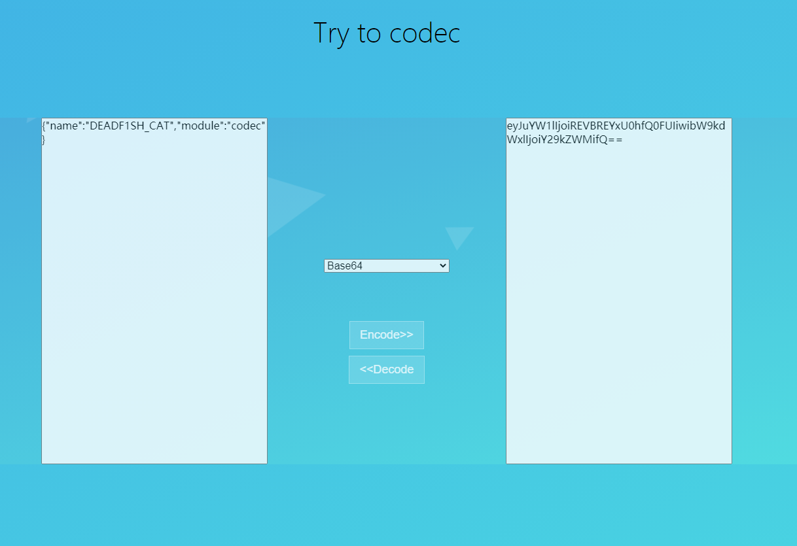

# Codec

## 简介

一款简单编解码工具，适合本地无网情况使用，可以进行一些简单的编解码，个人练练手的小工具。

基于python2.7

## 功能

- base64
- base32
- unicode
- utf-7
- utf-8
- url
- hex
- html
- rot13
- flask session
- JSON Web Token
- to be continue

## 使用

- 模块使用：

  直接import引入，示例在代码中都有演示

- 直接控制台调用：

  不建议，因为windows下的编码问题容易出bug，python2.7的缘故也会存在一些问题。

- flask启动-图形化示例：

  以网页的形式部署项目，使用简单高效，强烈推荐~

  ```shell
  $ python2 flask-coding.py
  ```

## Web界面展示



 